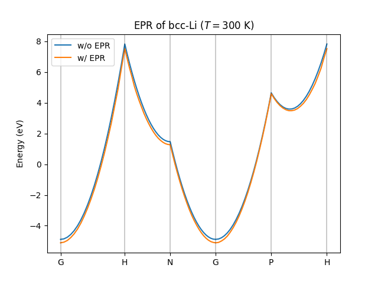

# Elphem
Python Library for Calculations of **El**ectron-**Ph**onon Interactions with **Em**pty Lattice

## Installation
```shell
git clone git@github.com:cohsh/elphem.git
cd elphem
pip install .
```

## Features
Currently, Elphem allows calculations of
- (reciprocal) lattice vectors from lattice constants.
- electronic structures with empty lattice approximation.
- phonon dispersion relations with Debye model.
- first-order electron-phonon couplings.
- one-electron self-energies.

## Examples
### Calculation of electron-phonon renormalization (EPR)




```python
import numpy as np
import matplotlib.pyplot as plt

from elphem import LatticeConstant, EmptyLattice, FreeElectron, DebyeModel, SelfEnergy2nd
from elphem.const import Mass, Energy, Length, AtomicWeight, BCC

def main():
    # Example: Li (BCC)
    a = 2.98 * Length.angstrom["->"]
    alpha = 109.47
    lattice_constant = LatticeConstant(a,a,a,alpha,alpha,alpha)
    lattice = EmptyLattice(lattice_constant)

    electron = FreeElectron(lattice, 1)
    
    mass = AtomicWeight.table["Li"] * Mass.Dalton["->"]
    
    debye_temperature = 344.0

    phonon = DebyeModel(lattice, debye_temperature, 1, mass)

    self_energy = SelfEnergy2nd(lattice, electron, phonon)

    n_g = np.array([2]*3)
    n_k = np.array([5]*3)
    
    g = lattice.grid(n_g)
    g = g.reshape(int(g.size/3),3)
    
    n_g_inter = np.array([1]*3)
    n_q = np.array([10]*3)

    k_names = ["G", "H", "N", "G", "P", "H"]

    k_via = []
    for name in k_names:
        k_via.append(BCC.points[name])

    n_via = 20
    x, k, special_x = lattice.reciprocal_cell.path(n_via, *k_via)
    
    selfen = np.empty((len(k)), dtype=complex)

    fig = plt.figure()
    ax = fig.add_subplot(1, 1, 1)

    temperature = 2 * debye_temperature

    for n in range(len(g)):
        eig = electron.eigenenergy(k + g[n])
        for i in range(len(k)):
            selfen[i] = self_energy.calculate(temperature, g[n], k[i], n_g_inter, n_q)

        epr = selfen.real

        ax.plot(x, eig * Energy.eV["<-"], color="tab:blue")
        ax.plot(x, (eig + epr) * Energy.eV["<-"], color="tab:orange")
    
    for x0 in special_x:
        ax.axvline(x=x0, color="black", linewidth=0.3)
    
    ax.set_xticks(special_x)
    ax.set_xticklabels(k_names)
    ax.set_ylabel("Energy ($\mathrm{eV}$)")
    ax.set_ylim([-7,Energy.eV["<-"]])
    ax.set_title("Example: Band structure of bcc-Li")

    file_name = "test_epr.png"
    fig.savefig(file_name)

if __name__ == "__main__":
    main()
```

### Calculation of scattering rate


```python
import numpy as np
import matplotlib.pyplot as plt

from elphem import LatticeConstant, EmptyLattice, FreeElectron, DebyeModel, SelfEnergy2nd
from elphem.const import Mass, Energy, Prefix, Time, Length, AtomicWeight

def main():
    # Example: Li (BCC)
    a = 2.98 * Length.angstrom["->"]
    alpha = 109.47
    lattice_constant = LatticeConstant(a,a,a,alpha,alpha,alpha)
    lattice = EmptyLattice(lattice_constant)

    electron = FreeElectron(lattice, 1)
    
    mass = AtomicWeight.table["Li"] * Mass.Dalton["->"]
    
    debye_temperature = 344.0

    phonon = DebyeModel(lattice, debye_temperature, 1, mass)

    temperature = debye_temperature

    self_energy = SelfEnergy2nd(lattice, electron, phonon)

    n_g = np.array([1]*3)
    n_k = np.array([5]*3)
    g, k = electron.grid(n_g, n_k)
    
    n_g_inter = np.array([1]*3)
    n_q = np.array([10]*3)
    selfen = self_energy.calculate(temperature, g, k, n_g_inter, n_q)

    epsilon_nk = electron.eigenenergy(k + g)

    fig = plt.figure()

    ax1 = fig.add_subplot(2, 1, 1)
    ax2 = fig.add_subplot(2, 1, 2)

    for ax in [ax1, ax2]:
        ax.scatter(epsilon_nk * Energy.eV["<-"], selfen.imag / (Time.SI["<-"] / Prefix.pico), label="$\mathrm{Im}\Sigma^\mathrm{Fan}$")

        ax.set_ylabel("Scattering rate ($\mathrm{ps}^{-1}$)")
        ax.legend()

    ax2.set_xlabel("Electron energy ($\mathrm{eV}$)")
    ax2.set_yscale("log")
    ax2.set_ylim([1.0e-5 / (Time.SI["<-"] / Prefix.pico), selfen.imag.max() / (Time.SI["<-"] / Prefix.pico) * 2])
    ax1.set_title("Example: Scattering rate of bcc-Li")
    
    file_name = "test_scattering_rate.png"
    fig.savefig(file_name)

if __name__ == "__main__":
    main()
```

## License
MIT